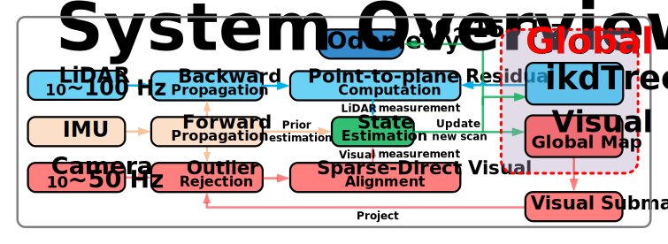
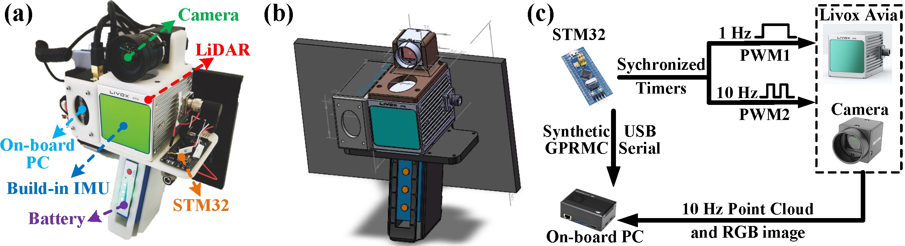

# FAST-LIVO

## Fast and Tightly-coupled Sparse-Direct LiDAR-Inertial-Visual Odometry

**3 July 2024**: We are excited to announce the upcoming release of [**FAST-LIVO2**](https://github.com/hku-mars/FAST-LIVO2) (some high-resolution results are already showcased). This new version delivers a **overwhelming enhancement** over **FAST-LIVO**, establishing an **undisputed state-of-the-art** in accuracy **(pixel-level)**, efficiency **(the first LIVO system applied for fully onboard autonomous UAV navigation)**, and robustness **(validated with over 2TB data, demonstrating exceptional performance in numerous degenerated LiDAR and camera scenarios)**.

**7 Dec 2023**: A **detailed step-by-step guide** for hard synchronization between Livox Mid-360/Avia and camera is published at [**LIV_hanheld**](https://github.com/sheng00125/LIV_handhold).

## 1. Introduction

**FAST-LIVO** is a fast LiDAR-Inertial-Visual odometry system, which builds on two tightly-coupled and direct odometry subsystems: a VIO subsystem and a LIO subsystem. The LIO subsystem registers raw points (instead of feature points on e.g., edges or planes) of a new scan to an incrementally-built point cloud map. The map points are additionally attached with image patches, which are then used in the VIO subsystem to align a new image by minimizing the direct photometric errors without extracting any visual features (e.g., ORB or FAST corner features).

**Contributors**: [Chunran Zheng 郑纯然](https://github.com/xuankuzcr)， [Qingyan Zhu 朱清岩](https://github.com/ZQYKAWAYI)， [Wei Xu 徐威](https://github.com/XW-HKU)

<div align="center">
    
</div>

### 1.1 Our paper

Our paper has been accepted to **IROS2022**, which is now available on **arXiv**:  [FAST-LIVO: Fast and Tightly-coupled Sparse-Direct LiDAR-Inertial-Visual Odometry](https://arxiv.org/abs/2203.00893).

If our code is used in your project, please cite our paper following the bibtex below:

```
@article{zheng2022fast,
  title={FAST-LIVO: Fast and Tightly-coupled Sparse-Direct LiDAR-Inertial-Visual Odometry},
  author={Zheng, Chunran and Zhu, Qingyan and Xu, Wei and Liu, Xiyuan and Guo, Qizhi and Zhang, Fu},
  journal={arXiv preprint arXiv:2203.00893},
  year={2022}
}
```

### 1.2 Our related video

Our accompanying videos are now available on **YouTube** (click below images to open) and [**Bilibili**](https://www.bilibili.com/video/BV15q4y1i7sj?spm_id_from=333.337.search-card.all.click).

<div align="center">
<a href="https://www.youtube.com/watch?v=C6Pb_0W9E_g" target="_blank"></a>
</div>

## 2. Prerequisited

### 2.1 Ubuntu and ROS

Ubuntu 16.04~20.04.  [ROS Installation](http://wiki.ros.org/ROS/Installation).

### 2.2 PCL && Eigen && OpenCV

PCL>=1.6, Follow [PCL Installation](https://pointclouds.org/). 

Eigen>=3.3.4, Follow [Eigen Installation](https://eigen.tuxfamily.org/index.php?title=Main_Page).

OpenCV>=3.2, Follow [Opencv Installation](http://opencv.org/).

### 2.3 Sophus

 Sophus Installation for the non-templated/double-only version.

```bash
git clone https://github.com/strasdat/Sophus.git
cd Sophus
git checkout a621ff
mkdir build && cd build && cmake ..
make
sudo make install
```

### 2.4 Vikit

Vikit contains camera models, some math and interpolation functions that we need. Vikit is a catkin project, therefore, download it into your catkin workspace source folder.

```bash
cd catkin_ws/src
git clone https://github.com/uzh-rpg/rpg_vikit.git
```

### 2.5 **livox_ros_driver**

Follow [livox_ros_driver Installation](https://github.com/Livox-SDK/livox_ros_driver).

## 3. Build

Clone the repository and catkin_make:

```
cd ~/catkin_ws/src
git clone https://github.com/hku-mars/FAST-LIVO
cd ../
catkin_make
source ~/catkin_ws/devel/setup.bash
```

## 4. Run the package

Please note that our system can only work in the hard synchronized LiDAR-Inertial-Visual dataset at present due to the unestimated time offset between the camera and IMU. The frame headers of the camera and the LiDAR are at the same physical trigger time.

### 4.1 Important parameters

Edit `config/xxx.yaml` to set the below parameters:

- `lid_topic`: The topic name of LiDAR data.
- `imu_topic`: The topic name of IMU data.
- `img_topic`: The topic name of camera data.
- `img_enable`: Enbale vio submodule.
- `lidar_enable`: Enbale lio submodule.
- `point_filter_num`: The sampling interval for a new scan. It is recommended that `3~4` for faster odometry, and `1~2` for denser map.
- `outlier_threshold`: The outlier threshold value of photometric error (square) of a single pixel. It is recommended that `50~250` for the darker scenes, and `500~1000` for the brighter scenes. The smaller the value is, the faster the vio submodule is, but the weaker the anti-degradation ability is.
- `img_point_cov`: The covariance of photometric errors per pixel. 
- `laser_point_cov`: The covariance of point-to-plane redisual per point. 
- `filter_size_surf`: Downsample the points in a new scan. It is recommended that `0.05~0.15` for indoor scenes, `0.3~0.5` for outdoor scenes.
- `filter_size_map`: Downsample the points in LiDAR global map. It is recommended that `0.15~0.3` for indoor scenes, `0.4~0.5` for outdoor scenes.
- `pcd_save_en`: If `true`, save point clouds to the PCD folder. Save RGB-colored points if `img_enable` is `1`, intensity-colored points if `img_enable` is `0`.
- `delta_time`: The time offset between the camera and LiDAR, which is used to correct timestamp misalignment.

After setting the appropriate topic name and parameters, you can directly run **FAST-LIVO** on the dataset.

### 4.2 Run on private dataset

Download our collected rosbag files via OneDrive ([FAST-LIVO-Datasets](https://connecthkuhk-my.sharepoint.com/:f:/g/personal/zhengcr_connect_hku_hk/Esiqlmaql0dPreuOhiHlXl4Bqu5RRRIViK1EyuR4h1_n4w?e=fZdVn0)) containing **4** rosbag files.

```
roslaunch fast_livo mapping_avia.launch
rosbag play YOUR_DOWNLOADED.bag
```

### 4.3 Run on benchmark dataset

NTU-VIRAL
```
roslaunch fast_livo mapping_avia_ntu.launch
rosbag play YOUR_DOWNLOADED.bag
```
MARS-LVIG
```
roslaunch fast_livo mapping_avia_marslvig.launch
rosbag play YOUR_DOWNLOADED.bag
```

## 5. Our hard sychronized equipment

To support the robotics community and enhance the reproducibility of our work, we provide CAD files for our handheld device, available in ".SLDPRT" and ".SLDASM" formats. These files can be opened and edited using Solidworks. Each module is designed for compatibility with FDM (Fused Deposition Modeling) technology, ensuring ease of 3D printing. Additionally, we open-source our **hardware synchronization scheme**, the **STM32 source code**, detailed **hardware wiring configuration instructions**, and **sensor ros driver**. Access these resources at our repository: [**LIV_handhold**](https://github.com/sheng00125/LIV_handhold).



## 6. Acknowledgments

Thanks for [FAST-LIO2](https://github.com/hku-mars/FAST_LIO) and [SVO2.0](https://github.com/uzh-rpg/rpg_svo_pro_open). Thanks for [Livox_Technology](https://www.livoxtech.com/) for equipment support.

Thanks [Jiarong Lin](https://github.com/ziv-lin) for the help in the experiments.

## 7. License

The source code of this package is released under [**GPLv2**](http://www.gnu.org/licenses/) license. We only allow it free for **academic usage**. For commercial use, please contact Dr. Fu Zhang [fuzhang@hku.hk](mailto:fuzhang@hku.hk).

For any technical issues, please contact me via email [zhengcr@connect.hku.hk](mailto:zhengcr@connect.hku.hk).
